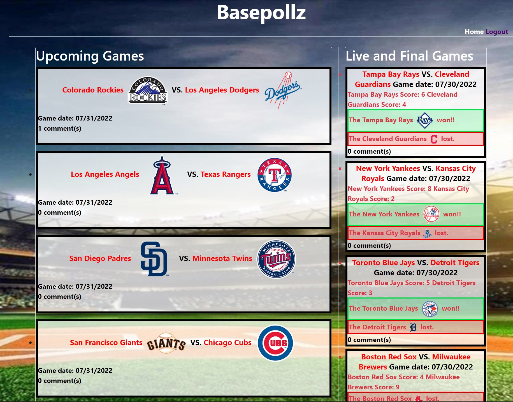

# Basepollz

  ## Table of Contents
  - [Description](#description)
  - [User Story](#user-story)
  - [Installation](#install)
  - [Usage](#usage)
  - [Questions](#questions)
  - [License](#license)

## Description
Basepollz is a webpage for baseball enthusiasts to view all previous baseball games, and tomorrow's upcoming games. Users can sign up, comment on games, and check scores that are updated daily. 

## User Story

•AS A baseball fan  
•I WANT a website to discuss each game and view upcoming games and previous games with scores  
•SO THAT I can track winners of each game and have a consolidated source of all MLB games  

## Installation

npm i
npm run seeds
npm start

## Usage

Deploy the website, sign up, browse the homepage, and comment on games.  
The website can be deployed by clicking on the following link:

## Credits

Developers:
Kenny Ng
TJ DeGirolamo
Jesse Sheehan
Jon Rosenblum

## License

MIT License

Copyright (c) [2022]

Permission is hereby granted, free of charge, to any person obtaining a copy
of this software and associated documentation files (the "Software"), to deal
in the Software without restriction, including without limitation the rights
to use, copy, modify, merge, publish, distribute, sublicense, and/or sell
copies of the Software, and to permit persons to whom the Software is
furnished to do so, subject to the following conditions:

The above copyright notice and this permission notice shall be included in all
copies or substantial portions of the Software.

THE SOFTWARE IS PROVIDED "AS IS", WITHOUT WARRANTY OF ANY KIND, EXPRESS OR
IMPLIED, INCLUDING BUT NOT LIMITED TO THE WARRANTIES OF MERCHANTABILITY,
FITNESS FOR A PARTICULAR PURPOSE AND NONINFRINGEMENT. IN NO EVENT SHALL THE
AUTHORS OR COPYRIGHT HOLDERS BE LIABLE FOR ANY CLAIM, DAMAGES OR OTHER
LIABILITY, WHETHER IN AN ACTION OF CONTRACT, TORT OR OTHERWISE, ARISING FROM,
OUT OF OR IN CONNECTION WITH THE SOFTWARE OR THE USE OR OTHER DEALINGS IN THE
SOFTWARE.
